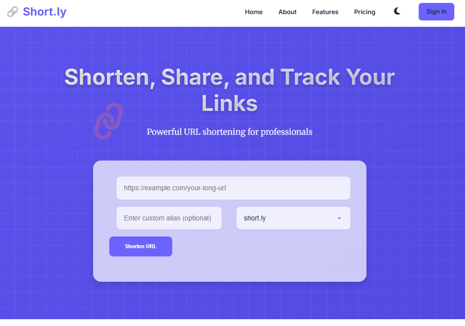
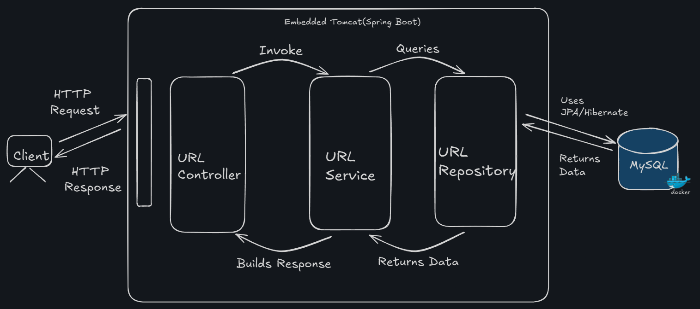

## 🔗 Short.ly - Advanced URL Shortener
Short.ly is a powerful and user-friendly URL shortening service designed for individuals and businesses. It transforms lengthy URLs into concise, shareable links, offering robust features like custom aliases, detailed analytics, and secure user authentication with subscription plans.

This project is built using Spring Boot for the backend and a modern HTML, CSS, and JavaScript frontend, ensuring a seamless and responsive user experience.

## Architecture




## ✨ Features
* URL Shortening: Convert long, unwieldy URLs into compact, easy-to-share short links.
* Custom Aliases: Create personalized and memorable short URLs (e.g., short.ly/MyProject).
* User Authentication: Secure user registration and login system to manage personal links.
* Subscription Plans:
  * Free: Basic link shortening with limited features. 
  * Pro: Advanced features like increased link limits, custom domains, API access, and priority support. 
  * Business: High-volume link management, multiple custom domains, premium analytics, and 24/7 support.
* Real-time History: View a list of your recently shortened URLs directly on the dashboard.
* Theming: Toggle between light and dark modes for a personalized browsing experience.
* Responsive Design: Optimized for seamless usage across all devices (desktop, tablet, mobile).
* Stripe Integration: Secure payment processing for subscription plans via Stripe Checkout.
* Backend Webhooks: Handles Stripe webhook events for automated subscription and payment management.
* Database Persistence: Stores all URL mappings, user data, subscriptions, and payments in a MySQL database.

## 🚀 Technologies Used

### Backend (Spring Boot):
* Java 17+
* Spring Boot 3.x: Application framework.
* Spring Data JPA: For robust database interaction and ORM. 
* MySQL: Relational database for data storage. 
* Stripe Java SDK: For payment processing and webhook handling. 
* HikariCP: High-performance JDBC connection pool. 
* Apache Commons Lang: Utility functions for string manipulation. 
* Maven: Build automation and dependency management. 
* Lombok: Reduces boilerplate code. 
* Flyway: Database migration tool for schema version control.

### Frontend (HTML, CSS, JavaScript):
* HTML5: Semantic structure for all web pages. 
* CSS3: Modern styling with custom properties (CSS variables) for easy theming (Light/Dark Mode).
* JavaScript (Vanilla JS): Interactive elements, API calls, and client-side logic.
* Font Awesome: For scalable vector icons.
* Google Fonts (Inter, Merriweather): Typography for a clean and professional look

## 📂 Project Structure

    .
    ├── src/
    │   ├── main/
    │   │   ├── java/com/example/url_shortener/
    │   │   │   ├── config/             # Spring configurations (e.g., PricingPlanConfig)
    │   │   │   ├── controller/         # REST API endpoints (Payment, Pricing, URL, Auth)
    │   │   │   ├── dto/                # Data Transfer Objects (e.g., UrlDto)
    │   │   │   ├── model/              # JPA Entities (User, Subscription, Payment, PricingPlan, Url)
    │   │   │   │   └── enums/          # Enums for statuses (PaymentStatus, SubscriptionStatus)
    │   │   │   ├── repository/         # Spring Data JPA repositories and PasswordEncoder
    │   │   │   ├── service/            # Business logic (Payment, Pricing, URL, User, Auth)
    │   │   │   └── UrlShortenerApplication.java # Main Spring Boot application
    │   │   └── resources/
    │   │       ├── resources/db/migration/ # Flyway SQL migration scripts
    │   │       ├── static/             # Frontend static assets
    │   │       │   ├── css/
    │   │       │   │   └── style.css   # Unified global styles
    │   │       │   ├── js/
    │   │       │   │   └── main.js     # Consolidated JavaScript logic for all pages
    │   │       │   ├── about.html      # About page
    │   │       │   ├── index.html      # Main URL shortening page
    │   │       │   ├── login.html      # User login page
    │   │       │   ├── price.html      # Pricing plans page
    │   │       │   └── signup.html     # User registration page
    │   │       └── application.properties # Spring Boot configuration (database, Stripe keys)
    ├── .gitignore                      # Specifies intentionally untracked files to ignore
    ├── pom.xml                         # Maven project object model
    └── README.md                       # Project README file

## ⚙️ Setup and Installation
### Prerequisites
* Java Development Kit (JDK) 17 or later
* Apache Maven
* MySQL Server (running locally or via Docker)
* Git
* An IDE (e.g., IntelliJ IDEA, VS Code) is recommended.

### Backend Setup
#### 1. Clone the repository:
```
git clone https://github.com/AzharuddinMalik/URLShort.git
cd URLShort
```
#### 2. MySQL Database Configuration:

* Ensure your MySQL server is running. 
* Update src/main/resources/application.properties with your MySQL database credentials.

 ```spel
spring.datasource.url=jdbc:mysql://localhost:3306/url_shortener_db?createDatabaseIfNotExist=true&useSSL=false&serverTimezone=UTC
spring.datasource.username=your_mysql_username
spring.datasource.password=your_mysql_password
spring.datasource.driver-class-name=com.mysql.cj.jdbc.Driver

# Hibernate Configuration
spring.jpa.hibernate.ddl-auto=update # Use 'update' for development, 'validate' or 'none' for production
spring.jpa.show-sql=true
spring.jpa.open-in-view=false
```

* Flyway will automatically run the migration script V1__Create_pricing_plan_table.sql to create necessary tables.
#### 3. Stripe API Keys (Secure Handling):
* Obtain your Stripe Secret Key (sk_test_...) and Webhook Secret (whsec_...) from your Stripe Dashboard (Developers -> API keys and Webhooks).

* IMPORTANT: DO NOT commit your actual keys to GitHub. For local development, you can add them to application.properties. For production, use environment variables.

* In src/main/resources/application.properties:
```
stripe.api.key=sk_test_YOUR_ACTUAL_STRIPE_SECRET_KEY
stripe.webhook.secret=whsec_YOUR_ACTUAL_STRIPE_WEBHOOK_SECRET
```
#### 4. Build the Project:
```spel
mvn clean install
```

### Frontend Setup
The frontend files are located in src/main/resources/static/. They are served directly by the Spring Boot application. No separate build step is required for the frontend.


## ▶️ Usage
##### 1. Run the Spring Boot Application:

```spel
mvn spring-boot:run
```
The application will start on http://localhost:8080/.

#### 2. Access the Web Application:

Open your web browser and navigate to:
```
http://localhost:8080/
```
#### 3. Register and Log In:
* Navigate to /signup.html to create a new user account. 
* Navigate to /login.html to log in with your credentials.

#### 4. Shorten URLs:

* On the homepage (index.html), enter a long URL and optionally a custom alias. 
* Click "Shorten URL" to generate your short link.

#### 5. Explore Pricing and Subscribe:
* Visit /price.html to view different subscription plans. 
* Enter your email and click "Get Started" or "Start Free Trial" to be redirected to Stripe Checkout for secure payment.

#### 6. Stripe Webhook Setup (for full functionality):
* For local development, use a tool like ngrok to expose your local webhook endpoint to the internet.
```
ngrok http 8080
```
* Copy the https forwarding URL provided by ngrok. 
* Go to your Stripe Dashboard -> Developers -> Webhooks.
* Add a new endpoint: Paste your ngrok URL followed by ``` /api/payment/webhook ``` (e.g., ``` https://your-ngrok-url.ngrok-free.app/api/payment/webhook ```). 
* Select the events you want to listen to: ```checkout.session.completed```, ```invoice.paid```, ```customer.subscription.deleted``` . 
* Save the endpoint. This allows Stripe to notify your application of payment and subscription events.

## 🤝 Contributing
Contributions are welcome! If you'd like to contribute, please follow these steps:

1. Fork the repository.

2. Create a new branch (```git checkout -b feature/your-feature-name```).

3. Make your changes.

4. Commit your changes (```git commit -m 'feat: Add new feature'```).

5. Push to the branch (```git push origin feature/your-feature-name```).

6. Open a Pull Request.

## 📄 License
This project is licensed under the MIT License - see the LICENSE file for details.